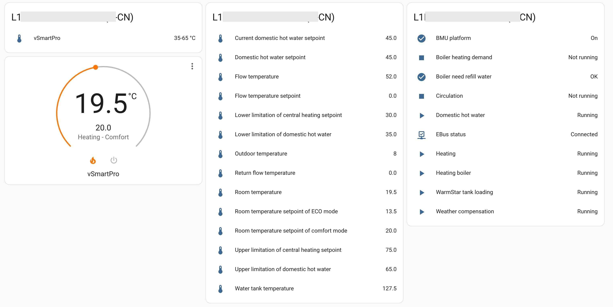

# home-assistant-vaillant-plus
[![GitHub Release][releases-shield]][releases]
[![GitHub Activity][commits-shield]][commits]
[![Coverage][coverage-shield]][coverage]
![GitHub all releases][download-all]
![GitHub release (latest by SemVer)][download-latest]
[![License][license-shield]][license]

[![hacs][hacsbadge]][hacs]
[![Project Maintenance][maintenance-shield]][user_profile]
[![BuyMeCoffee][buymecoffeebadge]][buymecoffee]

[![Community Forum][forum-shield]][forum]

[English](README.md) | 简体中文

Home Assistant 自定义集成，用于控制威能 Vaillant+ App（威管家）中的 vSMART 设备。

## 系统要求

Home Assistant 2024.2 或更高版本。

## 截图



## 安装

### 前置条件
- 需要先通过威能 Vaillant+（[iOS](https://apps.apple.com/cn/app/%E5%A8%81%E7%AE%A1%E5%AE%B6/id1465568192) | Android）App 完成 vSMART 设备的配网。

### 安装方式
#### HACS
点击下面的链接添加到你的 Home Assistant。

[](https://my.home-assistant.io/redirect/hacs_repository/?owner=daxingplay&repository=home-assistant-vaillant-plus&category=integration)

也可以在 HACS 中搜索 `Vaillant Plus`。

#### 手动安装
把 `custom_components/vaillant_plus` 复制到 Home Assistant 的 `config` 目录下。

### 安装后的步骤
- 重启 Home Assistant
- 在 `设置 -> 设备与服务` 中找到本集成
- 点击 `添加集成`，搜索 `Vaillant Plus`
- 在 Vaillant Plus 集成中点击 `配置`，开始配置流程
- 输入威能 Vaillant+ App 的用户名和密码
- 登录成功后，从列表中选择对应的 vSMART 设备
- 完成

## 常见问题

### `The unit of sensor.… (°C) cannot be converted to the unit of previously compiled statistics (None)`

从 v1.2.4 或更早版本升级后，每个温度传感器会出现一次该报错，例如：

```
The unit of sensor.flow_temperature (°C) cannot be converted to the unit of
previously compiled statistics (None). Generation of long term statistics will
be suppressed unless the unit changes back to None or a compatible unit.
```

v1.2.5 之前，温度传感器只声明了温度设备类别，没有声明单位，因此 Home Assistant
记录的长期统计数据是没有单位的。v1.2.5 补上了缺失的 `°C`，而记录器不会把这两种
数据混在一起，所以在你告诉它旧数据的单位之前，会停止为这些传感器生成长期统计
数据。当前数值和短期历史记录不受影响。

在 Home Assistant 中修复一次即可，无需重新安装：

1. 打开 [开发者工具 -> 统计数据](https://my.home-assistant.io/redirect/developer_statistics/)，也可以直接点击日志中的链接。
2. 找到日志里列出的每个 `sensor.*` 实体，点击旁边的问题提示。
3. 选择把历史统计数据的单位更新为 `°C` 的选项。原有读数本来就是摄氏度，只是没有标注单位，所以历史数据会被保留。删除统计数据同样可以消除该报错，但会丢失旧数据。

修复后，长期统计数据会在下一个记录周期恢复生成，该报错也不会再出现。

## 欢迎贡献代码！
如果你想为本项目做贡献，请先阅读[贡献指南](CONTRIBUTING.md)。

本集成基于 integration_blueprint 构建。

***

[vaillant-plus]: https://github.com/daxingplay/home-assistant-vaillant-plus
[buymecoffee]: https://www.buymeacoffee.com/daxingplay
[buymecoffeebadge]: https://img.shields.io/badge/buy%20me%20a%20coffee-donate-yellow.svg?style=flat-square
[commits-shield]: https://img.shields.io/github/commit-activity/y/daxingplay/home-assistant-vaillant-plus.svg?style=flat-square
[commits]: https://github.com/daxingplay/home-assistant-vaillant-plus/commits/master
[hacs]: https://hacs.xyz
[hacsbadge]: https://img.shields.io/badge/HACS-Custom-orange.svg?style=flat-square
[coverage-shield]: https://img.shields.io/coverallsCoverage/github/daxingplay/home-assistant-vaillant-plus?style=flat-square
[coverage]: https://coveralls.io/github/daxingplay/home-assistant-vaillant-plus?branch=master
[exampleimg]: example.png
[forum-shield]: https://img.shields.io/badge/community-forum-brightgreen.svg?style=flat-square
[forum]: https://github.com/daxingplay/home-assistant-vaillant-plus/issues
[license]: https://github.com/daxingplay/home-assistant-vaillant-plus/blob/master/LICENSE
[license-shield]: https://img.shields.io/github/license/daxingplay/home-assistant-vaillant-plus.svg?style=flat-square
[maintenance-shield]: https://img.shields.io/badge/maintainer-daxingplay-blue.svg?style=flat-square
[releases-shield]: https://img.shields.io/github/release/daxingplay/home-assistant-vaillant-plus.svg?style=flat-square
[releases]: https://github.com/daxingplay/home-assistant-vaillant-plus/releases
[user_profile]: https://github.com/daxingplay
[download-all]: https://img.shields.io/github/downloads/daxingplay/home-assistant-vaillant-plus/total?style=flat-square
[download-latest]: https://img.shields.io/github/downloads/daxingplay/home-assistant-vaillant-plus/latest/total?style=flat-square
