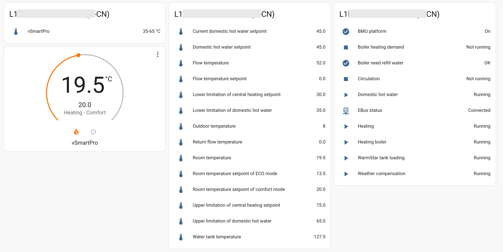

[![GitHub Release][releases-shield]][releases]
[![GitHub Activity][commits-shield]][commits]
[![Coverage][coverage-shield]][coverage]
[![License][license-shield]][license]

[![hacs][hacsbadge]][hacs]
[![Project Maintenance][maintenance-shield]][user_profile]
[![BuyMeCoffee][buymecoffeebadge]][buymecoffee]

[![Community Forum][forum-shield]][forum]

_Component to integrate with [vaillant-plus][vaillant-plus]._

**This component will set up the following platforms.**

Platform | Description
-- | --
`binary_sensor` | Show something `True` or `False`.
`sensor` | Show info from API.
`climate` | Control your vaillant boiler for heating.
`water_heater` | Control your vaillant water heater.

## Screenshot


## Installation

1. Click install.
1. In the HA UI go to "Configuration" -> "Integrations" click "+" and search for "Vaillant Plus".



## Configuration is done in the UI

<!---->

***

[vaillant-plus]: https://github.com/daxingplay/home-assistant-vaillant-plus
[buymecoffee]: https://www.buymeacoffee.com/daxingplay
[buymecoffeebadge]: https://img.shields.io/badge/buy%20me%20a%20coffee-donate-yellow.svg?style=for-the-badge
[commits-shield]: https://img.shields.io/github/commit-activity/y/daxingplay/home-assistant-vaillant-plus.svg?style=for-the-badge
[commits]: https://github.com/daxingplay/home-assistant-vaillant-plus/commits/master
[hacs]: https://hacs.xyz
[hacsbadge]: https://img.shields.io/badge/HACS-Custom-orange.svg?style=for-the-badge
[coverage-shield]: https://img.shields.io/coverallsCoverage/github/daxingplay/home-assistant-vaillant-plus?style=for-the-badge
[coverage]: https://coveralls.io/github/daxingplay/home-assistant-vaillant-plus?branch=master
[exampleimg]: example.png
[forum-shield]: https://img.shields.io/badge/community-forum-brightgreen.svg?style=for-the-badge
[forum]: https://github.com/daxingplay/home-assistant-vaillant-plus/issues
[license]: https://github.com/daxingplay/home-assistant-vaillant-plus/blob/main/LICENSE
[license-shield]: https://img.shields.io/github/license/daxingplay/home-assistant-vaillant-plus.svg?style=for-the-badge
[maintenance-shield]: https://img.shields.io/badge/maintainer-daxingplay-blue.svg?style=for-the-badge
[releases-shield]: https://img.shields.io/github/release/daxingplay/home-assistant-vaillant-plus.svg?style=for-the-badge
[releases]: https://github.com/daxingplay/home-assistant-vaillant-plus/releases
[user_profile]: https://github.com/daxingplay
